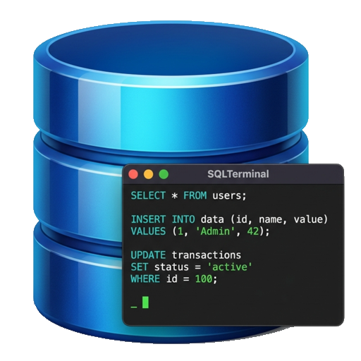

# SQLTerminal
A native macOS SQL terminal built with SwiftUI. Connect to SQLite or PostgreSQL databases and run queries with a clean, minimal interface.

<p align="center">
  
</p>

<p align="center">
  
  
  
  
</p>


## Overview
SQLTerminal brings a nostalgic terminal feel to database management. Write SQL in the bottom pane, hit **⌘E** to execute, and see results in the top pane.
Use command-arrows (⌘↑↓) for history replay.

|Version|Date|Description|
|-------|----|-----------|
|1.1.3 | June 14, 2026 | Off-main query execution + cancel; SSL/TLS modes with status-bar lock & connection details; read-only mode; destructive-statement confirmation; run-selection / statement-at-cursor; transaction controls; schema sidebar; `SQLCore` test suite |
|0.1.2 | June 14, 2026 | Auto-updates (Sparkle); detailed PostgreSQL connection errors & connection UX; selectable output |
|0.1.1 | March 23, 2026|Initial version - SQLite, Postgres|

## Features

### Database Support
- **SQLite** — Connect to existing databases or create new ones
- **PostgreSQL** — Connect with automatic authentication method detection (SCRAM-SHA-256, MD5, plaintext, trust). Failed connections report the server's real reason — including the exact `pg_hba.conf` line to add for "no entry" rejections
- **SSL/TLS for PostgreSQL** — choose **Off**, **Prefer**, or **Require**; a green lock in the status bar shows when the connection is actually encrypted (works with managed Postgres: RDS, Supabase, Neon, …)

### Connections
- **Recent connections** and **saved/named profiles** for one-click reconnect
- Optional **Keychain** password storage, with a show/hide toggle
- Click the status-bar connection (or its lock) for **connection details** — engine, host, database, user, encryption

### Terminal Interface
- Split-pane layout with draggable divider
- **Responsive while querying** — execution runs off the main thread, so a slow or network query never freezes the UI, and an unreachable host won't hang the app
- **Cancel** a running query with **⌘.** (or the toolbar button)
- Run the **whole editor** (**⌘E**), just the **selection**, or the **statement under the cursor** (**⌘↩**)
- Command history with **⌘↑** / **⌘↓**
- Multi-statement execution (`$$`-aware splitter handles PL/pgSQL bodies)
- Dot-commands for common operations (`.tables`, `.schema`, `.help`)
- Syntax-safe input (smart quotes auto-corrected to straight quotes)

### Schema Browser
- Collapsible sidebar listing the connection's tables (public schema for Postgres), each expandable to its columns
- Click a table to drop a `SELECT` into the editor; right-click to preview rows or copy the name

### Safety
- **Read-only mode** — a per-window toggle that blocks writes and DDL before they reach the database
- **Destructive-statement confirmation** — prompts before `DROP`, `TRUNCATE`, or a `DELETE`/`UPDATE` without a `WHERE`

### Transactions
- **Begin / Commit / Rollback** from the toolbar, with an in-transaction indicator in the status bar

### Results
- Tabular output with alternating row shading
- **Select any text** in the output pane, or right-click any row or cell to copy
- Export full results as **TSV** or **CSV** (paste directly into Excel/Numbers)
- Horizontal and vertical scrolling for wide/tall result sets

### Multi-Session
- **⌘N** opens a new window with an independent database connection
- Each window maintains its own session, history, and connection
- Mix SQLite and PostgreSQL sessions side by side
- Window title shows engine, database name, and user

### Auto-Updates
- Built-in **Sparkle** updater — new versions install in place
- **SQLTerminal ▸ Check for Updates…**, plus automatic background checks
- Updates are EdDSA-signed and shipped as notarized, Developer ID–signed builds

### Dot-Commands

| Command | Description |
|---------|-------------|
| `.tables` | List all tables |
| `.views` | List all views |
| `.indexes [table]` | List indexes |
| `.schema [table]` | Show CREATE statements / column definitions |
| `.columns <table>` | Show column details |
| `.count <table>` | Count rows |
| `.first <table>` | Show first 10 rows |
| `.last <table>` | Show last 10 rows |
| `.fk <table>` | Show foreign keys |
| `.dbinfo` | Show database properties |
| `.size` | Show database size |
| `.encoding` | Show encoding |
| `.connect <database>` | Switch PostgreSQL database, keeping credentials (alias: `.use`) |
| `.databases` | List all PostgreSQL databases |
| `.schemas` | List all PostgreSQL schemas |
| `.clear` | Clear the terminal output |
| `.help` | Show all available commands |

### Keyboard Shortcuts

| Shortcut | Action |
|----------|--------|
| **⌘E** | Execute the whole editor |
| **⌘↩** | Run selection, or the statement under the cursor |
| **⌘.** | Cancel the running query |
| **⌘↑** | Previous command from history |
| **⌘↓** | Next command from history |
| **⌘N** | New window / session |
| **⌘W** | Close window |

## Installation

### Download (recommended)
Download the latest signed, notarized **`.dmg`** from the [**Releases** page](https://github.com/arcanii/SQLTerminal/releases/latest), open it, and drag **SQLTerminal** into your Applications folder. From then on the app updates itself via Sparkle — you'll be offered new versions automatically, or trigger a check with **SQLTerminal ▸ Check for Updates…**.

### Build from source

**Requirements:** Xcode 26+, macOS 26.2+

```bash
git clone https://github.com/arcanii/SQLTerminal.git
cd SQLTerminal
open SQLTerminal.xcodeproj
```

Then build and run with **⌘R**. To produce a signed, notarized release build, see [docs/RELEASING.md](docs/RELEASING.md).

### Tests

The pure SQL logic — the `$$`-aware statement splitter, the read/write/destructive classifier, and the `pg_hba.conf` formatting — lives in a `SQLCore` Swift package (`SQLTerminal/Core`) and is covered by unit tests:

```bash
swift test
```

## License
SQLTerminal is licensed under the **GNU GPL-3.0**. See [LICENSE](LICENSE).
